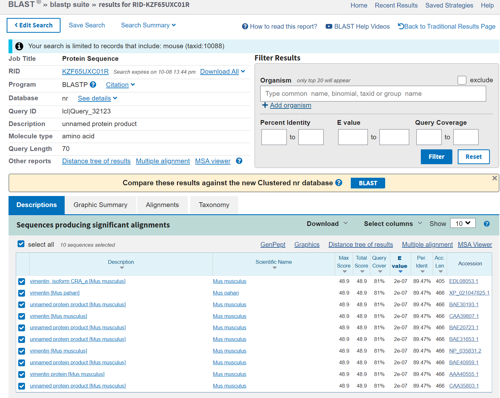

# BLAST

## Blast sequences

- 1

### Parameters:


### Results:


- 2

### Scripts

**homework.sh**
```bash
#!/bin/bash
seq=$1
for i in {1..10}
do
	# 打乱序列并输出文件
	shuf_name='>shuffle_seq'$i'\n'
	shuf_seq=`echo $seq | fold -w1 |shuf| tr -d '\n'`
	echo -e $shuf_name$shuf_seq > $i.txt
done
wait
for i in {1..9}
do
	j=$[$i+1]
	for k in $(seq $j 10)
	do
		# 设置输出文件名
		output_name=$i'_'$k'.txt'
		# blastp进行比对
		blastp -query $i.txt -subject $k.txt -out $output_name
	done
done
```

### Running & Results

```
sh homework.sh 'MSTRSVSSSSYRRMFGGPGTASRPSSSRSYVTTSTRTYSLGSALRPSTSRSLYASSPGGVYATRSSAVRL'
```

- 随机生成序列
以 **./1.txt** 为例
```
>shuffle_seq1
YSSYRSAAGSTRSPRSSRLRSMPSSAGSSSRLGSGTLYYVRSTSTMGTVSAATTFSPRPTVSSRVSYRLG
```
- 两两之间Blastp
以 **./5_8.txt** 为例
```
BLASTP 2.6.0+


Reference: Stephen F. Altschul, Thomas L. Madden, Alejandro A.
Schaffer, Jinghui Zhang, Zheng Zhang, Webb Miller, and David J.
Lipman (1997), "Gapped BLAST and PSI-BLAST: a new generation of
protein database search programs", Nucleic Acids Res. 25:3389-3402.


Reference for composition-based statistics: Alejandro A. Schaffer,
L. Aravind, Thomas L. Madden, Sergei Shavirin, John L. Spouge, Yuri
I. Wolf, Eugene V. Koonin, and Stephen F. Altschul (2001),
"Improving the accuracy of PSI-BLAST protein database searches with
composition-based statistics and other refinements", Nucleic Acids
Res. 29:2994-3005.


Database: User specified sequence set (Input: 8.txt).
           1 sequences; 70 total letters


Query= shuffle_seq5

Length=70
                                                                      Score     E
Sequences producing significant alignments:                          (Bits)  Value

  shuffle_seq8                                                        14.6    0.087


> shuffle_seq8
Length=70

 Score = 14.6 bits (26),  Expect = 0.087, Method: Compositional matrix adjust.
 Identities = 10/22 (45%), Positives = 15/22 (68%), Gaps = 0/22 (0%)

Query  7   LGTVASGSGTRRSSSSTYYYSS  28
           L + ++G  + RSS+ TYY SS
Sbjct  41  LASGSTGGLSYRSSTVTYYRSS  62


Lambda      K        H        a         alpha
   0.307    0.116    0.309    0.792     4.96 

Gapped
Lambda      K        H        a         alpha    sigma
   0.267   0.0410    0.140     1.90     42.6     43.6 

Effective search space used: 4096


  Database: User specified sequence set (Input: 8.txt).
    Posted date:  Unknown
  Number of letters in database: 70
  Number of sequences in database:  1


Matrix: BLOSUM62
Gap Penalties: Existence: 11, Extension: 1
Neighboring words threshold: 11
Window for multiple hits: 40

```

### Explain

```
# 基础信息，BLAST的比对库为自定义的序列文件 8.txt
# 数据集内有1条序列，70个氨基酸
Database: User specified sequence set (Input: 8.txt).
           1 sequences; 70 total letters

# 输入序列名
Query= shuffle_seq5
# 输入序列及比对结果
# 包括Score和可信度指标E-value
Length=70
                                                                      Score     E
Sequences producing significant alignments:                          (Bits)  Value

  shuffle_seq8                                                        14.6    0.087


> shuffle_seq8
Length=70

 Score = 14.6 bits (26),  Expect = 0.087, Method: Compositional matrix adjust.
 Identities = 10/22 (45%), Positives = 15/22 (68%), Gaps = 0/22 (0%)
```

```
# 最高得分的局部匹配结果
# Query序列的7-28和Subject序列的41-62联配
Query  7   LGTVASGSGTRRSSSSTYYYSS  28
           L + ++G  + RSS+ TYY SS
Sbjct  41  LASGSTGGLSYRSSTVTYYRSS  62
```

```
# 统计参数估计值
# Gapped需要额外估计参数sigma
Lambda      K        H        a         alpha
   0.307    0.116    0.309    0.792     4.96 

Gapped
Lambda      K        H        a         alpha    sigma
   0.267   0.0410    0.140     1.90     42.6     43.6 
```
参数估计详见[Myers EW, Miller W. Optimal alignments in linear space. Comput Appl Biosci. 1988 Mar;4(1):11-7](10.1093/bioinformatics/4.1.11)

```
# 基本信息
Effective search space used: 4096


  Database: User specified sequence set (Input: 8.txt).
    Posted date:  Unknown
  Number of letters in database: 70
  Number of sequences in database:  1


Matrix: BLOSUM62
Gap Penalties: Existence: 11, Extension: 1
Neighboring words threshold: 11
Window for multiple hits: 40
```